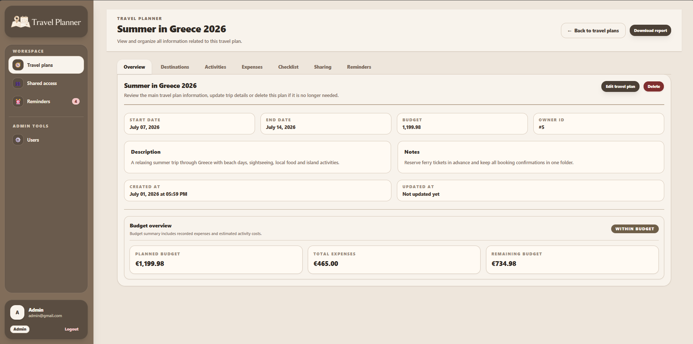
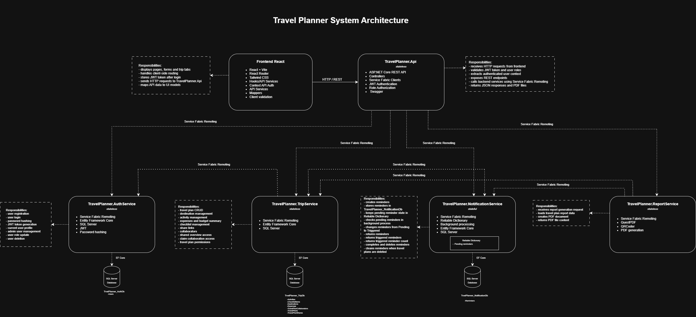
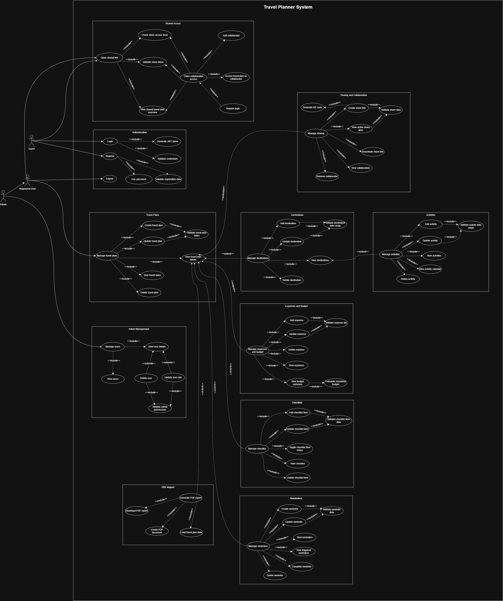

# Travel Planner

Travel Planner is a web application for planning and organizing trips.

The application allows users to manage travel plans, destinations, activities, expenses, checklist items, reminders, sharing links, collaborators and PDF reports.

Project developed for the course **Primena veb programiranja u infrastrukturnim sistemima**.

---

## Running the Project

### Prerequisites

Before running the project, make sure the following tools are installed:

- Visual Studio 2022
- .NET 8 SDK
- Microsoft Service Fabric SDK
- SQL Server Express
- SQL Server Management Studio
- Node.js
- npm

---

## Backend Setup

The backend is implemented as a Microsoft Service Fabric application.

Steps:

1. Start the local Service Fabric cluster
2. Open the backend solution in Visual Studio
3. Check SQL Server connection strings in backend configuration files
4. Run database migrations if needed
5. Start the Service Fabric application from Visual Studio

Service Fabric Explorer is available at:

```txt
http://localhost:19080/Explorer
```

The backend contains the following projects and services:

- `TravelPlanner.Api`
- `TravelPlanner.AuthService`
- `TravelPlanner.TripService`
- `TravelPlanner.NotificationService`
- `TravelPlanner.ReportService`
- `TravelPlanner.Contracts`

---

## Frontend Setup

Go to the frontend application folder:

```bash
cd frontend/TravelPlanner
```

Install dependencies:

```bash
npm install
```

Start the frontend application:

```bash
npm run dev
```

The frontend is usually available at:

```txt
http://localhost:5173
```

---

## Environment Configuration

The frontend uses an `.env` file for the backend API URL.

Example:

```env
VITE_API_BASE_URL=http://localhost:PORT/api
```

Replace `PORT` with the port used by `TravelPlanner.Api`.

Example:

```env
VITE_API_BASE_URL=http://localhost:8120/api
```

---

## Backend Configuration

Backend projects use `appsettings.json` and `appsettings.Development.json` configuration files.

Local development settings such as database connection strings and JWT secret should be placed in `appsettings.Development.json`.

Each project can have its own `appsettings.Development.json` file.

---

### API configuration

It needs the JWT secret because it validates authenticated requests.

Example `TravelPlanner.Api/appsettings.Development.json`:

```json
{
  "Jwt": {
    "Secret": "your-development-secret-key"
  }
}
```

---

### Service configuration with database

Services that use SQL Server should define their own connection string.

Example `appsettings.Development.json` for a service with database access:

```json
{
  "ConnectionStrings": {
    "DatabaseName": "Server=localhost\\SQLEXPRESS;Database=YourDatabaseName;Trusted_Connection=True;TrustServerCertificate=True;"
  }
}
```

Replace:

```txt
DatabaseName
```

with the connection string key used by the service.

Examples:

```txt
AuthDb
TripDb
NotificationDb
```

Replace:

```txt
YourDatabaseName
```

with the SQL Server database name.

Examples:

```txt
TravelPlanner_AuthDb
TravelPlanner_TripDb
TravelPlanner_NotificationDb
```

---

### AuthService configuration

`TravelPlanner.AuthService` uses a database connection string and the JWT secret because it generates JWT tokens after login.

Example `TravelPlanner.AuthService/appsettings.Development.json`:

```json
{
  "ConnectionStrings": {
    "AuthDb": "Server=localhost\\SQLEXPRESS;Database=TravelPlanner_AuthDb;Trusted_Connection=True;TrustServerCertificate=True;"
  },
  "Jwt": {
    "Secret": "your-development-secret-key"
  }
}
```

The JWT secret in `TravelPlanner.Api` and `TravelPlanner.AuthService` must be the same.

---

### TripService configuration

Example `TravelPlanner.TripService/appsettings.Development.json`:

```json
{
  "ConnectionStrings": {
    "TripDb": "Server=localhost\\SQLEXPRESS;Database=TravelPlanner_TripDb;Trusted_Connection=True;TrustServerCertificate=True;"
  }
}
```

---

### NotificationService configuration

Example `TravelPlanner.NotificationService/appsettings.Development.json`:

```json
{
  "ConnectionStrings": {
    "NotificationDb": "Server=localhost\\SQLEXPRESS;Database=TravelPlanner_NotificationDb;Trusted_Connection=True;TrustServerCertificate=True;"
  }
}
```

If your SQL Server instance is not `localhost\SQLEXPRESS`, replace it with your local SQL Server instance name.

---

## Database Migrations

The backend uses Entity Framework Core migrations for SQL Server databases.

Migrations are executed from the Service Fabric solution folder:

```bash
cd backend/TravelPlannerSF
```

Each service that owns a database has its own migrations.

Run database update for each database service:

```bash
dotnet ef database update --project TravelPlanner.AuthService --startup-project TravelPlanner.AuthService

dotnet ef database update --project TravelPlanner.TripService --startup-project TravelPlanner.TripService

dotnet ef database update --project TravelPlanner.NotificationService --startup-project TravelPlanner.NotificationService
```

These commands create or update the local SQL Server databases used by the backend services:

```txt
TravelPlanner_AuthDb
TravelPlanner_TripDb
TravelPlanner_NotificationDb
```

General command format:

```bash
dotnet ef database update --project ServiceProjectName --startup-project ServiceProjectName
```

---

## SQL Server Permissions

When services run inside the local Service Fabric cluster, they may use:

```txt
NT AUTHORITY\NETWORK SERVICE
```

If migrations work, but the running service cannot access the database, add this user to the required database.

Example:

```sql
USE [YourDatabaseName];
GO

CREATE USER [NT AUTHORITY\NETWORK SERVICE] FOR LOGIN [NT AUTHORITY\NETWORK SERVICE];
GO

ALTER ROLE db_owner ADD MEMBER [NT AUTHORITY\NETWORK SERVICE];
GO
```

Replace `YourDatabaseName` with one of the project databases:

```txt
TravelPlanner_AuthDb
TravelPlanner_TripDb
TravelPlanner_NotificationDb
```

If the user already exists, skip the `CREATE USER` command and run only the `ALTER ROLE` command.

---

## Project Overview

Travel Planner helps users organize all important travel information in one place.

The main entity of the system is a **travel plan**.  
A travel plan can contain destinations, activities, expenses, checklist items, reminders, share links and collaborators.

A user can:

- create and manage travel plans
- add destinations
- plan activities by date
- track expenses and budget
- manage checklist items
- create reminders
- share travel plans using links and QR codes
- collaborate with other users
- generate PDF reports

---

### Application Preview



---

## Technologies

### Frontend

- React
- Vite
- React Router
- Tailwind CSS
- Context API
- JavaScript
- Custom hooks
- API service layer
- Client-side validation

### Backend

- ASP.NET Core
- Microsoft Service Fabric
- Service Fabric Remoting
- Entity Framework Core
- SQL Server Express
- JWT Authentication
- Role Authorization
- BCrypt password hashing
- QuestPDF
- QRCoder

---

## System Architecture

The system is organized as a React frontend application and a Microsoft Service Fabric backend.

The frontend communicates only with `TravelPlanner.Api` through HTTP/REST requests.  
`TravelPlanner.Api` validates the JWT token, checks user roles and calls backend services using Service Fabric Remoting.

Backend services are separated by responsibility:

- `AuthService` handles authentication and user management
- `TripService` handles the main travel planning logic
- `NotificationService` handles reminders, pending reminder state and background reminder processing
- `ReportService` generates PDF reports

The system uses separate SQL Server Express databases for authentication, travel planning and notifications.

### Architecture Diagram



---

## Use Case Diagram

The use case diagram shows the main actors and system functionalities.

Main actors:

- Guest
- Registered User
- Admin

The diagram includes authentication, travel plans, destinations, activities, expenses, checklist, reminders, sharing, shared access, PDF report and admin management.



---

## Backend Services

### TravelPlanner.Api

`TravelPlanner.Api` is the REST entry point of the backend system.

Type:

- Stateless Service

Responsibilities:

- receives HTTP requests from the frontend
- validates JWT token
- checks user roles
- extracts authenticated user context
- exposes REST endpoints
- calls backend services using Service Fabric Remoting
- returns JSON responses and PDF files

Main controllers:

- `AuthController`
- `TripsController`
- `SharedTripsController`
- `RemindersController`
- `ReportsController`
- `AdminUsersController`

---

### TravelPlanner.AuthService

`AuthService` is responsible for authentication and user management.

Type:

- Stateless Service

Responsibilities:

- user registration
- user login
- password hashing
- JWT token generation
- current user profile
- admin user overview
- user role update
- user deletion

Database:

- `TravelPlanner_AuthDb`

---

### TravelPlanner.TripService

`TripService` is the central business service of the application.

Type:

- Stateless Service

Responsibilities:

- travel plan CRUD
- destination management
- activity management
- expense management
- budget summary
- checklist management
- share link management
- collaborators
- shared overview access
- claim collaboration access
- travel plan permissions

Database:

- `TravelPlanner_TripDb`

---

### TravelPlanner.NotificationService

`NotificationService` is responsible for reminders.

Type:

- Stateful Service

Responsibilities:

- create reminders
- store reminders in `NotificationDb`
- keep pending reminders in Reliable Dictionary
- check pending reminders in background process
- change reminder status from `Pending` to `Triggered` when reminder time is reached
- return triggered reminder count
- complete and delete reminders
- clean reminder data when a travel plan is deleted

Database:

- `TravelPlanner_NotificationDb`

Stateful storage:

- Reliable Dictionary for pending reminder state

---

### TravelPlanner.ReportService

`ReportService` is responsible for PDF report generation.

Type:

- Stateless Service

Responsibilities:

- receives report generation request
- loads travel plan report data
- creates PDF document
- returns PDF file content

Used libraries:

- QuestPDF
- QRCoder

---

## Service Communication

The frontend does not communicate directly with backend services or databases.

Main communication flow:

```txt
React Frontend
    -> HTTP / REST
TravelPlanner.Api
    -> Service Fabric Remoting
Backend Services
    -> EF Core
SQL Server Databases
```

Primary Service Fabric Remoting calls from API:

```txt
TravelPlanner.Api -> IAuthService -> TravelPlanner.AuthService
TravelPlanner.Api -> ITripService -> TravelPlanner.TripService
TravelPlanner.Api -> INotificationService -> TravelPlanner.NotificationService
TravelPlanner.Api -> IReportService -> TravelPlanner.ReportService
```

Some backend services also communicate with each other using Service Fabric Remoting.

Internal Service Fabric Remoting calls:

```txt
TravelPlanner.NotificationService -> ITripService -> TravelPlanner.TripService

TravelPlanner.TripService -> IAuthService -> TravelPlanner.AuthService
TravelPlanner.TripService -> INotificationService -> TravelPlanner.NotificationService

TravelPlanner.ReportService -> ITripService -> TravelPlanner.TripService
TravelPlanner.ReportService -> INotificationService -> TravelPlanner.NotificationService
```

### Why internal service communication is used

`NotificationService` calls `TripService` to validate travel plan access before creating, reading, updating, completing or deleting reminders.

`TripService` calls `AuthService` when working with collaborators. Collaborator records store user ids, while user profile data is owned by `AuthService`, so `TripService` requests user data when it needs to display collaborator information.

`TripService` calls `NotificationService` when deleting a travel plan, so all reminders connected to that travel plan are removed from `NotificationDb`, and any pending reminder state is removed from the Reliable Dictionary.

`ReportService` calls `TripService` and `NotificationService` when generating a PDF report. It collects travel plan data, destinations, activities, expenses, budget summary, checklist items, share links and reminders, and then generates the PDF file.

This keeps each service focused on its own responsibility:

- `AuthService` owns user and authentication data
- `TripService` owns travel plan data, collaboration data and travel plan deletion flow
- `NotificationService` owns reminder data, pending reminder state, background reminder processing and reminder cleanup logic
- `ReportService` generates PDF reports using data collected from other services

---

## Main Features

### Authentication

The system supports registration and login using JWT authentication.

Passwords are hashed before being stored in the database.

Roles:

- User
- Admin

---

### Travel Plans

Users can create, view, update and delete travel plans.

A travel plan contains:

- title
- description
- start date
- end date
- budget
- notes

---

### Destinations

Users can add destinations to a travel plan.

Each destination contains:

- name
- location
- arrival date
- departure date
- notes

Destination dates must be inside the travel plan date range.

---

### Activities

Users can create activities for destinations.

Each activity contains:

- title
- date
- start time
- end time
- location
- estimated cost
- status

Activities must be inside the destination date range.

---

### Expenses and Budget

Users can track travel expenses and view budget summary.

The system calculates:

- planned budget
- total expenses
- remaining budget
- budget status

---

### Checklist

Users can manage checklist items for a travel plan.

Supported actions:

- add checklist item
- view checklist
- update checklist item
- toggle completed status
- delete checklist item

---

### Reminders

Users can create reminders connected to travel plans.

Reminder statuses:

- Pending
- Triggered
- Completed

Pending reminders are stored in the Reliable Dictionary until their reminder time is reached.

When the reminder time is reached, the background process changes the reminder status from `Pending` to `Triggered`.

Triggered reminders are shown to the user and counted in the sidebar badge.

---

### Sharing and Collaboration

Users can share travel plans using generated links and QR codes.

Supported access levels:

- View
- Edit

With `View` access, the shared user can only see the travel plan overview page.

With `Edit` access, a registered user can claim collaboration access and become a collaborator.

The owner can:

- view active share links
- deactivate share links
- view collaborators
- remove collaborators

---

### Shared Access

A shared link or QR code opens a shared overview page.

Shared access flow:

1. User opens a shared link or QR code
2. System validates the share token
3. System checks access level
4. `View` access shows only the shared overview page
5. `Edit` access shows the claim collaboration option
6. Guest users must log in or register before claiming access
7. Registered users can claim access and become collaborators
8. Collaborators can access travel plan management area

---

### PDF Report

Users can generate a PDF report for a travel plan.

The report contains:

- travel plan information
- destinations
- activities
- expenses
- budget summary
- checklist
- reminders
- share information

---

### Admin Management

Admin users can:

- view all users
- open user details
- update user role
- delete user

---

## Database

The system uses SQL Server Express databases:

- `TravelPlanner_AuthDb`
- `TravelPlanner_TripDb`
- `TravelPlanner_NotificationDb`

Main stored data:

- users
- travel plans
- destinations
- activities
- expenses
- checklist items
- reminders
- share links
- collaborators

---

## Author

Boban Jovičić

Project developed for the course **Primena veb programiranja u infrastrukturnim sistemima**.
